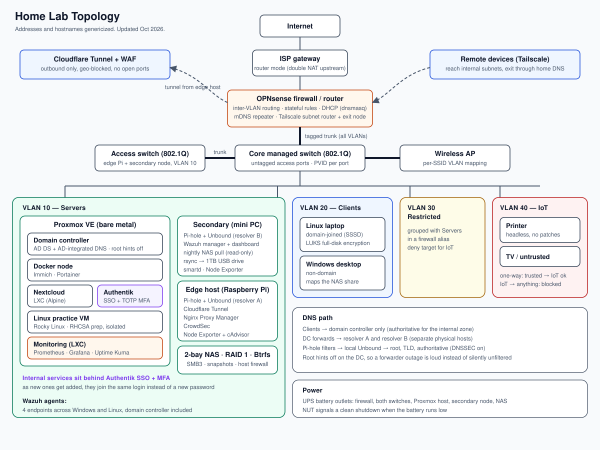

# Home Lab

A segmented, monitored home network I built to actually learn networking and sysadmin work, not just read about it. Active Directory with AD-integrated DNS, four VLANs behind an OPNsense firewall, two independent DNS resolvers on separate hardware, single sign-on with MFA in front of the admin panels, a Wazuh SIEM watching four endpoints, a Suricata intrusion detection system on the firewall, a local AI server on my desktop's GPU, Prometheus and Grafana charting the hardware, a hardened NAS with layered backups, and remote access that doesn't need any inbound ports opened.

> Addresses, hostnames, and the domain name below are genericized. Everything about the design and the reasoning is real.

---

## Topology

---

## Why this exists

I'm studying for Network+ after passing A+, and reading about VLANs and DNS hierarchy isn't the same as having a printer you can't reach from the wrong subnet, or a domain join that fails for reasons that look like a firewall problem and turn out not to be.

Most of what I've actually learned here came from things breaking. The write-ups below are the ones worth reading — each is a case where the obvious layer checked out clean and the real cause was somewhere I hadn't thought to look yet.

---

## Hardware and platform

| Role | Platform | Notes |
|---|---|---|
| Firewall / router | OPNsense | Inter-VLAN routing, stateful rules, outbound NAT, DHCP via dnsmasq |
| Hypervisor | Proxmox VE (bare metal) | Domain controller, Docker node, Nextcloud, Authentik, a monitoring container, a Linux practice VM |
| Domain controller | Windows Server | AD DS + AD-integrated DNS |
| Secondary resolver / services | Ubuntu Server (dedicated mini PC) | Pi-hole + Unbound, Wazuh manager, off-box backup target |
| Storage | 2-bay NAS, RAID 1 on NAS-rated CMR drives, Btrfs | File shares over SMB3, daily snapshots |
| Network edge | Raspberry Pi | Pi-hole + Unbound, Cloudflare Tunnel, CrowdSec, reverse proxy |
| Switching | Two managed 802.1Q switches | Core switch plus a second switch joined by a tagged trunk; untagged access ports with matching PVIDs |
| Wireless | Managed access point | Per-SSID VLAN mapping over a tagged trunk |
| Power | UPS + NUT | Firewall, switch, both servers, and the NAS on battery; clean shutdown when it runs low |

---

## Network segmentation

| Segment | Purpose | Notes |
|---|---|---|
| Management LAN | Firewall management | Untagged |
| VLAN 10 — Servers | Hypervisor, domain controller, both resolvers, SIEM | DHCP range for new hosts, reservations for everything permanent |
| VLAN 20 — Clients | Workstations and laptops | Domain-joined and non-domain |
| VLAN 30 — Restricted | Grouped with Servers in a firewall alias | Deny target for IoT |
| VLAN 40 — IoT | Printer, TV, untrusted devices | One-way isolation, see below |

Access ports are untagged with a matching PVID, so end devices land in the right segment without needing to know VLANs exist at all. The uplink to the firewall is a tagged trunk carrying every VLAN at once.

### Adding a second switch

When the core switch ran out of ports, I added a second managed switch instead of an unmanaged one. An unmanaged switch would have dumped everything plugged into it onto a single VLAN. The two switches are joined by an 802.1Q trunk: the uplink port is tagged for the server VLAN, and the access ports on the far side are untagged with a matching PVID. The edge Pi and the secondary DNS server moved onto it, and I checked DNS and connectivity from both before calling it done.

Two things I had to get straight while doing it:

- **VLAN membership and PVID are separate settings.** Membership decides which VLANs a port will carry, tagged or untagged. PVID decides which VLAN untagged traffic coming *in* lands on. Get one right and the other wrong, and the port looks configured but doesn't pass traffic.
- **VLANs belong to the network, not to a switch.** The second switch doesn't add VLANs, it adds ports. VLAN 10 on the new switch is the same VLAN 10 as everywhere else, because the trunk carries the tag across. The switch's own management address works the same way: I could reach the new switch from my desk, through the trunk.

I also left one port on the core switch as a permanent rescue port. It sits on the same Layer 2 segment as the hypervisor, so I can still reach Proxmox with a laptop and a static IP if the firewall is down. The laptop has a saved network profile for exactly this: plug into the rescue port, switch to it, and I'm on the management segment with no DHCP needed. I tested the path before I needed it, which turned out to matter (see the lockout write-up below).

### IoT isolation

The printer's control panel died a while back and it has no realistic patch cadence, so it lives in VLAN 40 under rules that only work one direction:

- Trusted VLANs can open a connection to the printer — fine, stateful inspection lets the reply back through.
- The printer can't open a connection to anything internal.
- The printer can't reach the internet either. It doesn't need cloud features, so there's no reason to let it try.

The part that actually matters is who initiates. A stateful firewall doesn't need to block replies — that would break printing outright — it just needs to make sure the printer itself never starts a session. If it's ever compromised, it has nowhere to phone home to.

Cross-VLAN discovery goes through an mDNS repeater on the firewall, since multicast DNS is link-local and won't cross a routed boundary by itself.

---

## DNS architecture

Three things here I made deliberately, not by default.

**Clients only ever point at the domain controller for DNS**, never at a filtering resolver directly. AD DNS is authoritative for the internal domain and holds the SRV records that let domain members find a controller in the first place. A filtering resolver has no idea that zone exists. Client resolvers don't reliably respect list order — plenty of them just query whichever server answers first, or round-robin — so if a filtering resolver were listed alongside the DC, AD lookups would intermittently land on a server that can't answer them. That shows up as authentication failures that look completely random, and they're miserable to chase down.

**Each resolver runs its own Unbound behind it.** Pi-hole doesn't actually resolve anything on its own — by default it forwards to a public resolver, which means every domain you look up is visible to whoever runs that. Unbound does real recursion instead: root servers, then TLD, then the domain's own authoritative servers, no third party ever sees the full picture. DNSSEC validation's on too.

**Root hints are off on the domain controller.** With them on, a DC that can't reach its forwarders just quietly resolves things itself. DNS keeps working, so nothing looks broken, while every blocklist and filtering rule silently stops applying. Turning root hints off means that failure is loud instead of invisible — I'd rather know DNS is down than not know it's unfiltered.

The two resolvers are on separate physical machines on purpose. Same host means same power supply, same disk, same kernel — they'd fail together, which isn't redundancy, it's just a second copy of the same failure.

---

## Remote access

Tailscale, with the firewall set up as both a subnet router and an approved exit node. Remote devices reach internal hosts directly, and all their traffic goes back out through the home connection, so DNS filtering still applies even when I'm not home.

This replaced a WireGuard setup that mostly worked but never quite routed traffic correctly. The [write-up](docs/03-wireguard-to-tailscale.md) covers it — short version, my ISP gateway sits in front of the firewall in router mode, and a VPN built around outbound connections sidesteps that problem instead of requiring me to solve it.

---

## Identity and access

Authentik sits in front of the lab's internal services as a single sign-on layer, with TOTP as a second factor. Before this, every admin panel had its own password and its own login page, which meant the security of the whole lab was really the security of whichever one I'd been laziest about. Anything new I stand up now goes behind Authentik as a matter of course, instead of getting its own standalone credential.

Each service is a proxy provider behind Authentik's embedded outpost. One thing worth knowing if you set this up yourself: creating the provider and the application on separate screens let me skip the authorization flow field without an obvious error, and the provider then never showed up as linkable. Building both through the combined "New Application" wizard fixed it.

The domain controller isn't behind it. RDP doesn't fit the proxy model, so that one needs a different approach and it's still on the list.

One thing I caught after the fact: every provider was pointed at Authentik's plain-HTTP port, which is what most quickstart guides show. It worked, so nothing complained, but admin passwords, TOTP codes, and session cookies were crossing the LAN in cleartext. What gave it away was my password manager refusing to autofill on an insecure page. All of them run over TLS now.

Later I found a second copy of that cleartext problem. The providers had been fixed, but the embedded outpost has its own `authentik_host` setting, which decides where it sends the browser to log in, and that one still pointed at plain HTTP on port 9000. In my normal browser an old session hid it. In a private window, every tile bounced to a second login page on the HTTP port, and that login silently failed, because the browser treats a different port as a different site and the session didn't carry over. Pointing the outpost at HTTPS 9443 (with certificate validation relaxed for the self-signed cert) fixed every tile at once, and I rotated the password that had crossed the LAN in the clear. The lesson was that fixing one setting isn't the same as fixing the problem: I should have searched for every place the old address lived.

**Termix** is the lab's SSH and remote-desktop front door: one browser tab, at my desk or on my phone, with saved hosts. It runs in its own unprivileged container (nesting and keyctl enabled for Docker), over HTTPS only, with the plain-HTTP port removed, sign-ups disabled after the first admin account, and its RDP helper bound to localhost. A tool that holds logins to every machine is a high-value target, so it stays off the Cloudflare tunnel and is reached only on the LAN or over Tailscale. Termix lives on the hypervisor, so it can't be the only way in: the phone keeps a direct SSH entry for the Proxmox node as a break-glass path. One quirk: Termix only turns HTTPS on at startup, so after installing a certificate it needs a container restart. Termix login requires a TOTP code, and the hosts it manages use SSH keys: one Ed25519 key per device I log in from (Termix, and a separate passphrase-protected one on my phone), with password authentication turned off in sshd on the Pi and the DNS/SIEM box once key login was proven from a second session. Sudo passwords are deliberately not stored in Termix, so a compromised Termix can't escalate. The lockdown is set by a drop-in file that sorts before the cloud-init one, because sshd keeps the first value it reads, and I confirmed it with `sshd -T` rather than trusting the file.

The honest gap: SSO is configured but not yet enforced. The backends still answer on their raw IPs, which skips Authentik entirely. Closing that is next.

---

## Monitoring and security

- **Wazuh SIEM** — manager on the secondary node, agents on four endpoints across Windows and Linux, domain controller included. Vulnerability detection, file integrity monitoring, CIS benchmark scoring. Logs get pruned at 7 days through a scheduled job plus an index lifecycle policy, sized against actual disk space before I started ingesting anything, not after.
- **Prometheus + Grafana** in their own container on the hypervisor. Node Exporter runs on the hypervisor, the edge Pi, the monitoring container and the secondary node, and cAdvisor on the Pi gives per-container numbers. CPU, memory, disk, and temperatures all go on one dashboard with history, so I can see a trend instead of a single snapshot. This replaced Netdata, which turned out to be the cause of a problem it was supposed to be watching for (see the write-ups).
- **CrowdSec** watching the reverse proxy on the edge host.
- **Suricata IDS** on the firewall, in IDS-only mode: it raises alerts and never blocks anything, so a bad rule can't take the network down. It watches the server, client and IoT interfaces with the Emerging Threats Open ruleset (about 61,000 rules). I left the WAN interface off, because I care about what's happening between my own segments more than internet background noise. Turning it on cost the firewall VM more memory (raised to 8 GB) and about 10% of its two CPU cores, and I took a Proxmox snapshot first so I could roll back. Next: a custom rule that fires on a harmless test DNS name so I can prove the pipeline end to end, then forwarding its alerts to Wazuh.
- **Cloudflare Tunnel + WAF** for anything exposed externally, geo-blocked, no inbound ports open on the firewall at all.
- **Cloudflare Access in front of the one public service.** The tunnel's only published route is the Uptime Kuma dashboard, so I can check on the lab even when Tailscale, the firewall or the whole hypervisor is down, which is exactly when I need it. Before, that put Kuma's own admin login on the open internet, along with a map of every monitored host and the alert webhook behind it. Now an Access policy allows exactly one identity, and anyone else is stopped at Cloudflare's edge before a single request reaches the Pi. Kuma's own login still sits behind that, so it's two separate locks, with CrowdSec watching the edge host as well.
- **Full-disk encryption** on the laptop. Deleting a domain account stops someone from logging in — it does nothing about the data already sitting on a stolen disk. Encryption is the actual fix for that.
- **Firmware kept current** via fwupd/LVFS, SSD and UEFI revocation updates included.

### First agent, first findings

I put the SIEM agent on the internet-facing edge host first, since it's the most exposed thing on the network and figured it should be the most watched. First scan came back with 13 critical and 125 high findings, and a 43% CIS pass rate.

The counts looked worse than they were once I actually read them. Four of the five criticals were in Samba client libraries, Perl socket code, and GnuTLS — all sitting on disk as dependencies of something else, none of them actually reachable through anything the box runs. A CVSS score tells you how bad a vulnerability is in theory; it says nothing about whether there's a path to it on your specific machine.

The more useful question was why Samba client libraries were even installed on a host that only does tunneling and intrusion detection. Patched everything regardless, but unused packages on an exposed box are attack surface whether or not this month's CVE list happens to mention them.

### The domain controller's turn

When the DC got its agent it came back with hundreds of critical and high findings, which looks like a disaster until you sort by package. Nearly all of it pointed at the same thing: the OS build was behind on cumulative updates. That's one problem showing up as a few hundred rows, and the fix was patching the build, not working through CVEs one at a time.

---

## Automated patching

Updates used to mean SSHing into each box one at a time, which is how a machine ends up three weeks behind. Now **Ansible runs through Semaphore**, a web UI with a key store, an inventory, a Git-backed playbook repository (this one), and a scheduler.

- One playbook runs `apt` with a safe upgrade, so packages I deliberately hold back (the SIEM agent, for example) stay held, then reports whether a reboot is needed.
- The secondary resolver and the edge Pi each have a task template and a **weekly schedule** that runs Sunday at 3 AM local time, when nothing depends on them. Cron schedules in Semaphore use UTC, so that's a different hour in the schedule than on my clock.
- Login and sudo credentials live in Semaphore's key store, never in the repository. SSH login and privilege escalation are separate credentials, and mixing them up was the most common failure while I built this (see below).
- I can also run any template by hand with one click when a security update can't wait for Sunday.

The Windows domain controller isn't in this yet. It gets patched through Group Policy with restarts limited to the night, because it also serves DNS for the whole network.

---

## Services

- **Nextcloud** for files, behind Authentik.
- **Immich** for photo backup, so my phone isn't the only copy and I can eventually stop paying for iCloud. Runs in Docker Compose on its own node, with the photo library stored on the NAS (see Storage and backup).
- **Authentik's app launcher** as the lab dashboard, so the page that links every service is also the one that logs you in. It replaced Homepage. The firewall is deliberately left off it: if Authentik is ever down, I still need a way into the network to fix it.
- **Uptime Kuma** on the edge Pi, checking 11 targets: the firewall, domain controller, secondary resolver, hypervisor, NAS, and the web interfaces for Authentik, Grafana, Immich and Pi-hole, plus two outside addresses to tell "my network is down" apart from "the internet is down". Ping for machines, HTTP(s) checks for services, so a box that answers but has a dead service still shows red. Everything alerts a Discord channel.
- **AI Wazuh digest** ([script](scripts/wazuh-digest.py)). Wazuh produces about 10,000 alerts a day, and in practice I wasn't reading them. A root-only script on the Wazuh host runs every morning, reads the last 24 hours of alerts, and groups them by rule with counts and which machines were involved. Only those summaries leave the box, never raw log lines, which carry usernames and IPs. It posts them to the same Cloudflare Worker, which has Workers AI write a short digest (a verdict of quiet, worth a look, or act now, then the notable items in plain English and what's safe to ignore) and sends it to Discord. The Worker key sits in a root-only file. The first run surfaced a level-8 account change and failed logons worth checking, and correctly called most of the volume routine Windows noise. Tuning that noise down is the next job.
- **AI alert helper** ([code](cloudflare/kuma-alert-ai/worker.js)). Kuma also sends each alert to a Cloudflare Worker, which asks Workers AI (Llama 3.3 70B) for the likely cause and the first things to check, given a short description of the lab, and posts that under the alert in Discord. The Worker ignores anything without a shared secret key, and the key and Discord webhook live in Cloudflare's encrypted secrets, never in the code. Recoveries skip the AI call to save the free daily quota. If the AI call fails, the alert still goes out with the error attached instead of being lost. On a test against an address that can never answer, it correctly pointed at connectivity and firewall rules first. It's a second opinion at 1 AM, not an authority: it didn't recognise that the address was a reserved documentation range.
- **Local AI server.** Open WebUI runs in its own small container on the server VLAN and talks to Ollama on my desktop, so the model (Qwen3 14B, about 10 GB) runs entirely on the desktop's GPU and nothing I type leaves my network. Ollama listens on the network only for that one container: a Windows Firewall rule allows the container's address to reach its port and nothing else, and Open WebUI has sign-ups turned off. I built a planning assistant on it that turns an assignment's grading sheet into a week-by-week schedule and asks me questions about my topic. It plans and organises; it doesn't write my work for me. Two things I learned the hard way: the default document retrieval only hands the model the top few chunks of a file, so my first test invented a topic and missed a whole section of the rubric. Switching on Full Context Mode fixed that. And the model's arithmetic isn't reliable, so point totals get checked against the original document.
- **Semaphore (Ansible UI)** for patching, covered in the next section.
- **Wake-on-LAN** through the firewall, so the desktop can be powered on from my phone. Wake-on-LAN only powers the machine on, so logging in once it's awake is the next piece I'm working out.

---

## Storage and backup

File storage lives on a 2-bay NAS on the server VLAN, running RAID 1 on NAS-rated drives with a Btrfs volume. It replaced a Samba share on the secondary node, which itself replaced a share on the domain controller once a capacity check showed about 17 GB free on its system drive. A domain controller filling its own disk can take authentication down for everyone.

I returned the first NAS I bought after finding out it no longer gets security updates. An unpatched box holding every file on the network is a bigger risk than having no NAS at all.

### Photos on the NAS

Immich's library lives on its own NAS share instead of the Docker node's local disk, so photos get the same RAID and snapshot protection as everything else. The Docker host mounts the share over SMB with a dedicated account that only has access to that one folder. Two details mattered:

- **Boot order.** If Docker starts before the NAS share is mounted, Immich happily starts with an empty library and begins writing to the local disk. A systemd dependency makes Docker wait for the mount, and the mount is marked as network-dependent so a slow NAS doesn't hang boot.
- **Verify, don't assume.** After switching the storage path I confirmed with `docker inspect` that the container's upload directory really pointed at the NAS mount, and then opened photos in the web UI to confirm they were being served from it.

### Hardening

- **Host firewall, default deny.** It only answers the server and client subnets. The firewall already separates VLANs, but this still holds if an upstream rule is wrong or a device inside an allowed VLAN is compromised.
- **Nothing facing the internet.** The vendor's cloud relay, DDNS, and UPnP are all off. The relay matters most: it's an outbound connection, so it would bypass inbound rules on both firewalls. Remote access goes through Tailscale like everything else.
- **TLS-only admin page** with MFA, auto-block after repeated failed logins, and DoS protection.
- **Minimal services.** SSH, Telnet, FTP, NFS, rsync, WebDAV, and network discovery are off. SMB1 is disabled, so it's SMB2/3 only.
- **Least-privilege accounts.** The admin account is never used for files. Everyday access uses a standard user with rights to one share.

### Three layers of protection

RAID isn't a backup: it mirrors deletions and ransomware to both drives instantly. So each layer covers something different.

| Threat | Covered by |
|---|---|
| One drive dies | RAID 1 mirror |
| File deleted, or ransomware encrypts the share | Daily Btrfs snapshots, kept 30 days, read-only (the photo share included) |
| The whole NAS dies or is stolen | Nightly off-box copy to a separate drive on the secondary node |
| Fire or flood | Nothing yet (see roadmap) |

The nightly copy runs from the secondary node through a **read-only service account**. Its password has to live on that machine, so read-only means a compromised backup host can read the files but can't change or delete them. I tested that instead of assuming it: mounted the share without the local read-only flag and tried to write, and the NAS refused. The script also checks that both the backup drive and the NAS mount are actually present before it runs, because `rsync --delete` against an empty mount point would wipe the backup. Files that change or get deleted are moved into dated folders instead of disappearing.

---

## Troubleshooting write-ups

These are the parts of this project I'd actually want to talk through in an interview.

1. **[DNS queries dropped with no log entry anywhere](docs/01-dns-silent-drop.md)** — every network layer checked out clean, firewall logs completely empty, and the actual cause was one application setting.
2. **[Domain join working, login failing on a correct password](docs/02-kerberos-clock-skew.md)** — authentication broken by clock drift, in a way that looked nothing like a time problem.
3. **[WireGuard handshaking fine, traffic going nowhere](docs/03-wireguard-to-tailscale.md)** — double NAT, a wrong endpoint, and eventually switching tools instead of grinding further.

### Smaller ones

Not worth a full write-up each, but they all taught me something.

- **Raspberry Pi running hot for no reason.** CPU pinned, fan on constantly. Turned out the memory cgroup controller was disabled at boot, so containerd kept failing to watch container memory and retrying in a loop. My first fix did nothing, because I'd put the kernel parameter on a second line of `cmdline.txt` and the Pi's bootloader only reads the first one. `/proc/cmdline` is what the kernel actually booted with, and it's what I should have checked first. Ended up rebuilding the Pi clean and applying the fix properly.
- **The Pi running hot again, months later.** The fan kept cycling and the Pi sat around 60°C. `ps` was misleading because its CPU column is an average over the process's whole lifetime. `top` showed the current picture: the Docker daemon at about 118% CPU, even though the containers themselves were quiet. Something was hammering the daemon, and the suspect was the monitoring agent: Netdata's Docker collector queries the daemon constantly. With Netdata stopped, the Docker daemon dropped to about 1.4% and the Pi cooled by about 10°C. I removed Netdata and moved to Prometheus, and the Grafana temperature graph is how I confirmed the fix stuck. Monitoring has a cost too, and it should be measured like anything else.
- **The rebuilt Pi couldn't get an IP.** Two problems stacked on each other. Its switch port was an untagged member of two VLANs at once, and VLAN 10 had never had a DHCP range configured at all. That second one also explained an earlier container that couldn't get an address, which I'd given up on at the time.
- **Nextcloud login did nothing.** Click login, nothing happens, no error. The browser side looked fine. The Nextcloud log said PHP couldn't write session data because its temp directory didn't exist. Created it with the right owner, restarted PHP-FPM, fixed. Lesson: when the UI gives you nothing, the application log usually has the answer.
- **Monitoring said the domain controller's disk was 86% full.** Its main drive had 18 GB free. The alert was about an 865 MB volume that a Windows update had given a drive letter: the recovery partition, which is meant to be nearly full. I removed the drive letter so Windows hides it again. The lesson was to check which volume an alert is actually measuring before cleaning anything up.
- **Backup service account rejected with the right password.** The kernel log showed `STATUS_LOGON_FAILURE`, which rules out permissions and networking. Resetting it to a long letters-and-digits password fixed it. Special characters are a common way a password that works in a browser breaks in a Linux credentials file. The other lesson was to stop retrying, because the NAS's auto-block counts every attempt.
- **Ansible could log in but couldn't patch anything.** `apt` failed with a lock permission error even though the playbook ran with privilege escalation turned on. Escalation was on, but it was using my own SSH account as the "become" user instead of root, so it escalated to nothing. Semaphore wants a separate credential for escalation. I'd lost time chasing the sudo implementation itself, which was a detour.
- **Uptime Kuma said "name or service not known" for a host that was fine.** Kuma runs inside a container whose resolver doesn't know my internal domain, so internal names fail there even though they work from my desk. Monitoring by IP fixed it, and it's a reminder that a container has its own view of the network.
- **Uptime Kuma HTTP check failed with an SSL "wrong version number" error.** A plain-HTTP service was being probed with HTTPS. That error message means one side is speaking TLS and the other isn't. A refused connection on another check meant the opposite problem: the host was reachable but nothing was listening on that port.
- **The Wazuh digest's first send got a 403.** My Worker answers a bad key with 404, so a 403 had to be coming from Cloudflare before the request ever reached it. Cloudflare's bot protection blocks requests that identify as Python's default `Python-urllib` client. Giving the script its own User-Agent fixed it. Knowing which layer produces which error code turned a vague failure into a one-line fix.
- **Cloudflare returned a 502 right after the new Access login worked.** A long blank page and then "Host: Error". The login passing told me the problem was behind Cloudflare, between the tunnel and the service. The tunnel route still pointed at the Pi's address from before I'd reinstalled its OS, on the wrong port too. The tunnel itself showed healthy the whole time, because the connector was fine and only the destination was stale. Pointing the route at the current address and Kuma's real port fixed it. When you rebuild a host, anything that points at it by address needs checking too.
- **The AI alert helper failed three different ways before it worked.** A 404 meant the Worker was rejecting Kuma's key, and the fix was setting both sides from one copy of it. A 1101 meant the Worker itself was crashing, and the cause was the Discord secret saved in lowercase while the code asked for it in capitals, since environment variable names are case-sensitive. Then the AI step failed silently, because I'd wrapped it in a fallback that hid the error. Making the fallback print the error showed the model had been retired months earlier, even though Cloudflare's own sample code still used it. Switching to a current model fixed it. The lesson was that a safety net that hides the error just leaves you guessing.
- **Nextcloud went down with a 503 after an automatic update.** The web server was fine. `occ status` showed the database still needed upgrading: the app had updated itself but the database hadn't followed, so Nextcloud refused to run on a half-upgraded install. I took a Proxmox snapshot, ran `occ upgrade`, and it came back. Snapshot first, because a failed database upgrade is the kind of thing you can't undo by hand.
- **Locked out of the firewall by my own two-factor setup.** I turned on a one-time-code login for the OPNsense admin page, and my password manager kept offering a stale code, so I couldn't get back in. Recovery was a chain: start the firewall VM from the hypervisor's command line, plug a laptop into the rescue port with a fixed address, boot the firewall into single-user mode and reset the admin password from there. The lesson was to never let the only path to a device depend on the thing you're changing. I turned the code login back off and kept HTTPS.
- **Shutting down the firewall VM cut off the thing I was using to manage it.** I reach the hypervisor's web page through the firewall, so choosing Shutdown or Stop from that page killed my own session, and Shutdown also means it doesn't come back by itself. Reboot is the right button, and the rescue port is the plan B.
- **A new container sat there with "No IP assigned".** A community install script's default put the container on the untagged management network, which has no DHCP by design. The script has a VLAN option, so I destroyed the container and rebuilt it on the server VLAN. Same lesson as the earlier trunk mistake: on a trunked bridge, a container with the wrong (or no) tag is on a different network than the one its settings imply.
- **Immich wouldn't start, then kept dying.** First it couldn't log in to its own database — the DB variables were only defined on the database container, never passed to the app container. Then the kernel's OOM killer kept killing it because the container only had 2 GB. More memory and lower job concurrency fixed both.

## [Mistakes and lessons](docs/mistakes.md)

The stuff I got wrong, including the dumb ones. Leaving these out would make the rest of this look a lot cleaner than it actually was to build.

---

## Roadmap

- A quarantine VLAN for isolating anything suspect
- Per-VM and per-container stats from Proxmox on the Grafana dashboard
- Extend Ansible patching beyond the Pi and the secondary resolver to the Proxmox host and the containers, and patch the domain controller through Group Policy
- A second Uptime Kuma instance on different hardware, since the current one lives on the Pi it can't alert about
- Send Suricata alerts to Wazuh so network and host events land in one place, then an isolated attack-practice range to test what it catches
- Real internal hostnames with proper certificates (a private subdomain that only my own DNS answers), which should also fix the single sign-on logins that fail today because the apps connect by IP address and the certificate doesn't match
- A second physical firewall with CARP failover, so the network stays up while the main one reboots
- Something for the domain controller that fits where Authentik doesn't
- Actually working through the CIS benchmark failures instead of just noting them
- Enforce SSO so the backends can't be reached by raw IP
- Join the NAS to Active Directory (the join stalls at the domain-server check; I suspect Windows Server 2025's stricter LDAP defaults)
- An internal certificate authority to replace self-signed certificates
- Add the photo share to the nightly off-box copy, and then offsite backup to cover the one threat the current layers don't
- Single sign-on for Immich through Authentik. I got as far as an OAuth provider and the Immich settings, but the Immich container fails its discovery request to Authentik even though the Docker host can reach it fine. I haven't found the cause yet, so it's parked until the internal certificate authority is in place, which removes one variable
- GNS3 topologies for routing/switching practice
- Building out the Rocky Linux practice VM for RHCSA prep. It's isolated on purpose, so I can break things there without taking down anything the lab depends on

---

## Certifications

- CompTIA A+ — certified (Core 1 and Core 2)
- CompTIA Network+ — in progress
